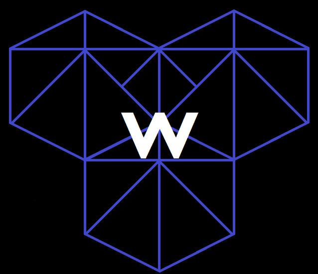

# warehouse

a federated business tool to connect the worlds moving resources.
warehouse aims to take the basic systems of buisness and turn them into their own data points to be collected, explored and predicted. 

## quick overview

the purpose of the tool is basically for organizations and businesses to manage the procurement and sale of specifically "things". it can also manage employee information as there needs to be a way to login into the application. 

the entire design is written inside `supergraph.graphql`. the comments above each type give the service that it belongs too. 

## models

the models library contains both the interactions with the database and the async-graphql 

## service descriptions

in the services directory there exists a service for each of the main functions of warehouse. each of these packages is just an async-graphql server that has environment vars points to the database and what address it should have. 

### IMS 

this service 